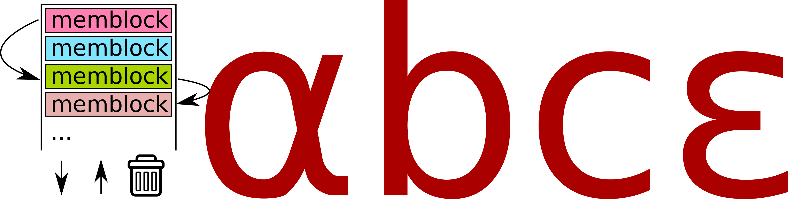
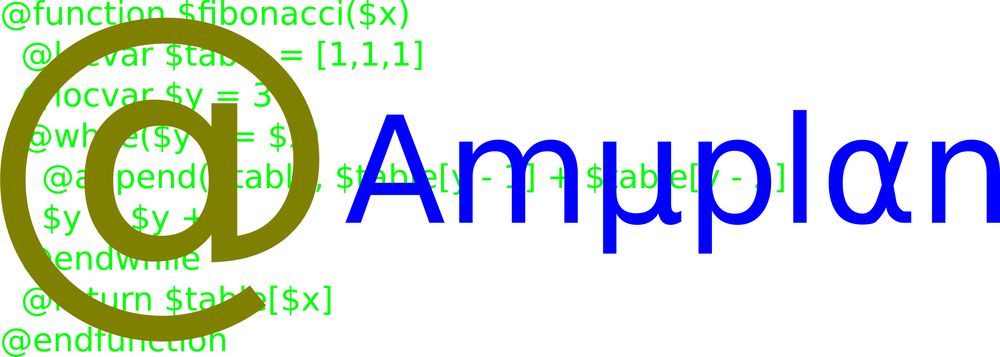

# Abce



abce is a stack-based bytecode engine. The bytecode format is designed to be
extensible and stable.

abce has been carefully designed so that the instruction argument order matches
that of most human-readable high-level programming languages. Thus, the
bytecode compiler can emit abce instructions as it sees high-level programming
language constructs. Therefore, for example `a-b` can be emitted as `a`, `b`,
`-` no matter whether `a` and `b` are single numbers of more complex
expressions. So, the rule to handle `a-b` needs no buffering: the handlers for
`a` and `b` can simply emit their bytecode.

The data model of abce is that everything is static:

* Nil
* Instruction pointer register value (used only in stack for function calls)
* Base pointer register value (used only in stack for function calls)
* Function address
* Boolean
* Double-precision IEEE 754 floating point number (used for integers too)

Or dynamic:

* Red-black tree
* Scope
* Array
* String (immutable)
* Packet buffer
* I/O stream

abce is strongly and dynamically typed. The typing resembles that of JSON and
deviates from that of Lua in that dictionaries and arrays are separate data
types.

abce memory-maps stack, text segment, data segment and many other segments.
This allows simplicity at the cost of creating huge mostly empty core files.
There are convenience functions that can be called just before emitting a core
dump to make the core file size smaller.

There is both reference counting and very simple garbage collection having an
adaptive threshold with hysteresis. Most of the time, reference counting frees
memory, but cyclical structures require garbage collection.

The object code format has been designed to be stable, using a clever
variable-length UTF-8-like encoding to support a huge number of instructions in
a byte-based code format.

Untrusted code is handled by having an instruction trap function that can also
limit the CPU time an abce program may use. Furthermore, the memory allocator
can be customized or adjusted in order to limit allocated memory amount.

The design of abce completely ignores multithreading. The idea is that
different threads should have different abce contexts, and thus, threading can
be ignored.

Where abce really shines is that it supports recursive scoping, both lexical
and dynamic, with scopes being creatable from the C API.

For convenience, the text segment is divided into two: a permanent text segment
and a temporary text buffer. The temporary buffer allows executing temporary
code that is not permanently stored to memory.

Example program that calculates 1+1:

```
PUSH_DBL, 1
PUSH_DBL, 1
ADD
DUMP
```

Another example program that stores an array `[[1,2],[3,4]]` to the dynamic
scope to variable `$AR`:

```
GETSCOPE_DYN
PUSH_DBL, addressof("AR")
PUSH_FROM_CACHE
PUSH_NEW_ARRAY
PUSH_NEW_ARRAY
PUSH_DBL, 1
APPEND_MAINTAIN
PUSH_DBL, 2
APPEND_MAINTAIN
APPEND_MAINTAIN
PUSH_NEW_ARRAY
PUSH_DBL, 3
APPEND_MAINTAIN
PUSH_DBL, 4
APPEND_MAINTAIN
APPEND_MAINTAIN
SCOPEVAR_SET
```

where `addressof("AR")` denotes the address of `"AR"` in the object cache. An
abce bytecode program has always an associated object cache, and it may be
executed only with the correct cache correspondng to the bytecode program.

# Amyplan



Amyplan is a modifiable yacc-based programming language. It is compiled to abce
bytecode and then executed.

What Amyplan successfully does is to have a grammar that can be embedded into
other Yacc grammars. All reserved words begin with the sigil `@` and variables
begin with the sigil `$`, so the requierments Amyplan places on the lexer are
small.

Amyplan is strongly typed, and indexing of different types of objects is
different. Arrays are indexed as `$ARRAY[2]` (indexing is zero-based),
dictionries as `$DICT{2}`, strings as `$STRING[@2]` an packet buffers as
`$PBUF{@2}`.

A variable `$VAR` inside a function always refers to a local variable. To
refer to global variables, the scope has to be specified: `@D $VAR` is a
dynamically scoped variable, `@L $VAR` is a lexically scoped variable.
You can also access parent scopes by `@DP`, `@LP` and prevent recursively
traversing scopes by `@DO`, `@LO`. You can also do both by `@DPO`, `@LPO`.

It is also possible to immediately evaluate a scope variable by `@I` at compile
time, or `@IP` for using the parent scope, or `@IO` for not traversing
recursively or `@IPO` for both.

Functions are defined in the following manner:

```
@function $FOO($a, $b, $c)
  @locvar $d = $a + $b + $c
  @return $d
@endfunction
```

A `@return` with no value returns `@nil`.

`if` and `if-else` are supported:

```
@function $BAR($a)
  @if ($a < 0)
    @return -$a
  @else
    @return $a
  @endif
@endfunction
```

`while` is supported:

```
@function $BAZ($a)
  @while ($a < 0)
    $a = $a + 360
  @endwhile
  @return $a
@endfunction
```

Loops can be breaken out of using `@break` and next iteration is obtained by
`@continue` immediately. Both `@break` and `@continue` take a positive integer
argument for specifying how many levels of loop it applies to.

It's also possible to have a pseudo-loop `@once` that is executed only once,
can be broken out of, and can be used with `@continue` to start executing it
again from start:

```
@function $BARF($a)
  @once
    @if ($a >= 0)
      @break
    @endif
    $a = $a + 360
    @if ($a < 0)
      @continue
    @endif
  @endonce
  @return $a
@endfunction
```

This `@once` can be useful for error handling.

Lists can be appended to:

```
@function $LA()
  @locvar $a = [1,2]
  @locvar $b = 3
  @locvar $c = [4,5]
  @append($a, $b)
  @appendlist($a, $c)
  @return $a
@endfunction
```

List appending can be done also inline with `@`:

```
@function $LAI()
  @locvar $b = [4,5]
  @locvar $a = [1,2,3, @$b]
  @return $a
@endfunction
```

Dictionaries can be constructed inline and edited, and the `= -` syntax can be
used to remove entries:

```
@function $DICT()
  @locvar $d = {"a": 3, "b": 4, "c": 5}
  $d{"d"} = 6
  $d{"a"} = -
  @return $d
@endfunction
```

Recursion is supported:

```
@function $fibonacci($x)
  @if($x<3)
    @return 1
  @else
    @return $fibonacci($x - 1) + $fibonacci($x - 2)
  @endif
@endfunction
```

...but not always the fastest option:

@function $fiboeff($x)
  @locvar $table = [1, 1, 1]
  @locvar $y = 3
  @while($y <= $x)
    @append($table, $table[$y - 1] + $table[$y - 2])
    $y = $y + 1
  @endwhile
  @return $table[$x]
@endfunction
